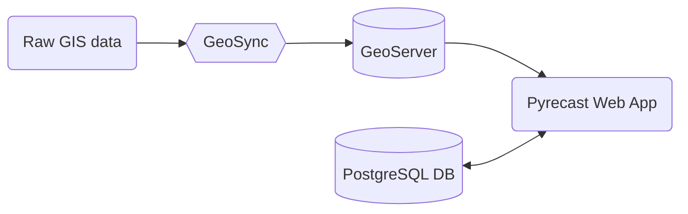
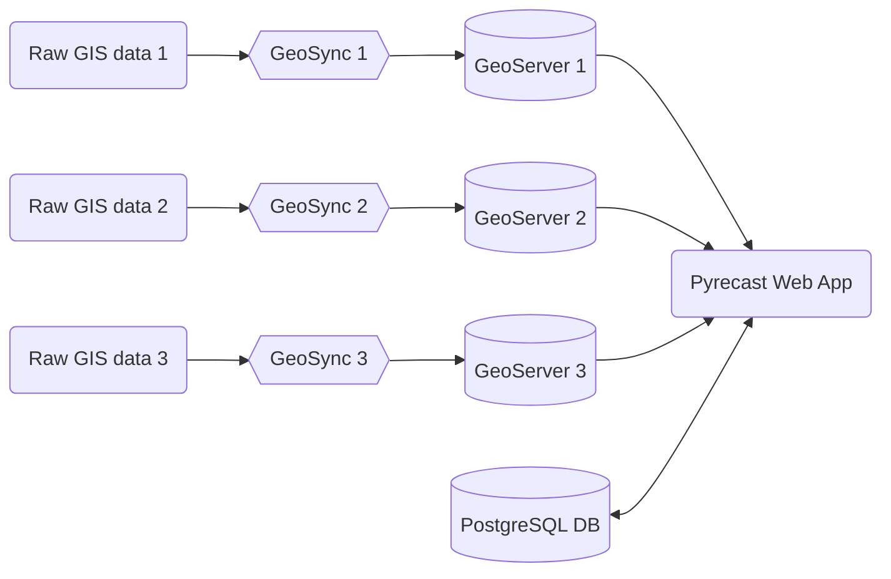

# Pyrecast Architecture

## Table of Contents
- [Overview](#pyrecast-architecture)
- [GCP, Match Drop, and Active Fires](#gcp-match-drop-and-active-fires)
  - [Active Fires Only](#active-fires-only)
  - [Match-Drop Only](#match-drop-only)
  - [Both Active Fires and Match-Drop](#both-active-fires-and-match-drop)

Pyrecast is a complicated web application with multiple moving parts.
This document aims to explain, at a high level, how the architecture is set up.
If you're looking for more granular detail, take a look at the Pyrecast back-end document.
The tech stack for the Pyrecast repository involves [Clojure](https://clojure.org/) (back-end), [ClojureScript](https://clojurescript.org/) (front-end), and [PostreSQL](https://www.postgresql.org/) (database).

A key task that we must perform on Pyrecast is to display a large amount of raw GIS data on the front-end.
To do so we must leverage two additional pieces of technology: GeoServer and GeoSync.
* [GeoServer](https://geoserver.org/) is an open source server for hosting geospatial data. It allows us to take raw GIS data and display it on the web via web services—the two most common being Web Mapping Service (WMS) and Web Feature Service (WFS).
* [GeoSync](https://github.com/pyregence/geosync) is a command-line application (written by SIG) that traverses a directory tree of raster and vector GIS files (e.g., GeoTIFFs, Shapefiles) and generates/runs the necessary REST commands to add workspaces, coveragestores, datastores, coverages, featuretypes, layers, and layergroups for each file to a running GeoServer instance.

Before a geospatial layer can be displayed on the Pyrecast front-end using GeoServer's web services, it must be registered on the GeoServer instance.
While it is certainly possible to manually register layers using GeoServer's web UI, this is unfeasible when you have numerous new layers each day.
On average, we keep the last three forecasts for each applicable Pyrecast tab (weather, risk, and active fires).
This means that any forecasts older than the most recent three need to be deregistered on the GeoServer.

From start to finish, here are the steps to display a layer on the front-end:

1. Raw GIS data is added to a VM where the Pyrecast web-app is hosted.
2. GeoSync—which is constantly listening for new GIS data on the VM—tells GeoServer which layers need to be registered and which layers need to be deregistered.
3. Finally, once the layers are appropriately registered on GeoServer, the Pyrecast web-app is able to make the appropriate WMS or WFS requests to display the layers on the front-end.

It's important to note that while the Pyrecast web-app itself has a Postgres database, it is **not** used to store information about any GeoServer layers.
Instead, all of the information about a layer comes from the GeoServer instance.
Currently, the Pyrecast Postgres DB is used primarily for storing users and organizations.
See the [Pyrecast Database document](./pyrecast-database.md) for more information.

```mermaid
flowchart LR
    A(Raw GIS data)-->B{{GeoSync}};
    B-->C[(GeoServer)];
    C-->D(Pyrecast Web App);
    E[(PostgreSQL DB)]<-->D;
```

While Pyrecast initially began with one GeoServer instance hosting every layer, it quickly outgrew just the one GeoServer.
There are now numerous GeoServers—each hosting their own layers—that Pyrecast makes requests to.
For example, one GeoServer might hold just the weather layers while another might hold just the risk layers.
Pyrecast's back-end allows us to specify which GeoServer we want to query from when requesting a layer.

```mermaid
flowchart LR
    A(Raw GIS data 1)-->B{{GeoSync 1}};
    B-->C[(GeoServer 1)];
    C-->D(Pyrecast Web App);

    E(Raw GIS data 2)-->F{{GeoSync 2}};
    F-->G[(GeoServer 2)];
    G-->D;

    H(Raw GIS data 3)-->I{{GeoSync 3}};
    I-->J[(GeoServer 3)];
    J-->D;

    K[(PostgreSQL DB)]<-->D;
```

## GCP, Match Drop, and Active Fires

### Active Fires Only
1. The `gcloud-sync-from-bucket` [Shepherd timer](https://gitlab.sig-gis.com/sig-gis/pyrecast-gcp-deployment/blob/main/guix/modules/sig-gis/geoserver-timers.scm) runs once per hour and downloads new GIS data to the `/srv/gis` folder.
2. The `sync-active-fires` Shepherd timer runs once per hour and launches a Bash script which submits one job to the `trinity` GeoSync server on localhost per folder under `/srv/gis/fire_spread_forecast`.
3. The `trinity` [GeoSync server](https://gitlab.sig-gis.com/sig-gis/pyrecast-gcp-deployment/tree/main/guix/config-files/geoserver-config/production/02-trinity-geoserver/) scans each of the folders under `/srv/gis/fire_spread_forecast` for GIS files, sends REST requests to the local GeoServer application to get a list of currently registered forecasts, and then sends a bunch of REST requests to the GeoServer telling it to register all of the new forecasts under `/srg/gis/fire_spread_forecast` that aren't already in its layer catalog.

### Match-Drop Only
1. The [kubernetes](https://gitlab.sig-gis.com/sig-gis/sig3/tree/main/resources/match-drop.edn) [GeoSync microservice](https://gitlab.sig-gis.com/sig-gis/pyrecast-scripts/blob/main/src/clj/pyrecast/geosync/geosync.clj) uploads match-drop results to the GeoServer(s) VM's `/srv/gis/match_drop_forecast` folder.
2. The [kubernetes](https://gitlab.sig-gis.com/sig-gis/sig3/tree/main/resources/match-drop.edn) [GeoSync microservice](https://gitlab.sig-gis.com/sig-gis/pyrecast-scripts/blob/main/src/clj/pyrecast/geosync/geosync.clj) submits one job to the `sierra` GeoSync server on that GeoServer VM.
3. The `sierra` [GeoSync server](https://gitlab.sig-gis.com/sig-gis/pyrecast-gcp-deployment/tree/main/guix/config-files/geoserver-config/development/03-sierra-geoserver/) scans the folder containing your match-drop forecast under `/srv/gis/match_drop_forecast` for GIS files, sends REST requests to the local GeoServer application to get a list of currently registered forecasts, and then sends a bunch of REST requests to the GeoServer telling it to register the new match-drop forecast.

### Both Active Fires and Match-Drop
4. After it finishes registering a new forecast, the GeoSync server runs its `:after` action hooks (from its `config.edn` file), which tell it to send an HTTPS request to the `/set-capabilities` route on the PyreCast web server.
5. The PyreCast server responds to this HTTPS request by sending another HTTPS WMS `GetCapabilities` request to the GeoServer.
6. The GeoServer responds with a list of the new forecast layers that are now available in its catalog.
7. The PyreCast server stores this information in memory in a Clojure atom.
8. When users visit the PyreCast website, their web browser downloads the PyreCast CLJS code, which requests the available layers from the PyreCast server's layers atom and uses this information to fill in the options in the various dropdowns in the website's left-hand sidebar.
9. Whenever users make a new selection from these dropdowns, their Mapbox JS code sends HTTPS WMS `GetMap` requests to the GeoServer, which then dynamically creates PNG images from the GIS data under its `/srv/gis` folder and returns them to the web browser to be displayed on the map canvas.
10. These PNG images are also stored in the GeoWebCache folder on the GeoServer VM, so that they can be returned quickly in the future.
