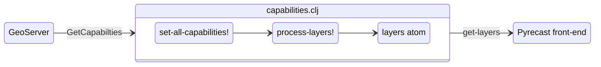

# Pyrecast Back-End

This document aims to go into more detail on Pyrecast's back-end.
In particular, we will focus on how a layer is fed in from the GeoServer instance to the Pyrecast back-end (for eventual use on the front-end).
If you have not read the [Pyrecast Architecture document](./pyrecast-architecture.md), you should do so before continuing.

The main file that we will focus on is `/src/clj/pyregence/capabilities.clj`.
This file is responsible for processing the layers that are registered on GeoServer.
In particular, it is responsible for parsing the massive XML response from the WMS `GetCapabilities` request.

## `GetCapabilities`

[`GetCapabilties`](https://docs.geoserver.org/latest/en/user/services/wms/reference.html#getcapabilities) is an operation that requests information about each of the layers that we have registered on a GeoServer instance.
This is the entry point from GeoServer to Pyrecast.
An example `GetCapabilities` request that we make to the `data` GeoServer instance is the following:
```
https://data.pyregence.org/geoserver/wms?SERVICE=WMS&VERSION=1.3.0&REQUEST=GetCapabilities
```
The above request will return a large XML response.
Among other things, the most basic information that we get from this request pertains to individual layers.
For example, the below `<Layer>` entry gives us information on the Landfire 2.0.0 Fire Behavior Fuel Model 40 (fbfm40) layer.

```xml
<Layer queryable="1" opaque="0">
    <Name>fuels-and-topography_landfire-2.0.0:fbfm40</Name>
    <Title>fbfm40</Title>
    <Abstract/>
    <KeywordList>
        <Keyword>LC20_F40_200</Keyword>
        <Keyword>WCS</Keyword>
        <Keyword>GeoTIFF</Keyword>
    </KeywordList>
    <CRS>EPSG:5070</CRS>
    <CRS>CRS:84</CRS>
    <EX_GeographicBoundingBox>
        <westBoundLongitude>-127.98775263969658</westBoundLongitude>
        <eastBoundLongitude>-65.25444546636926</eastBoundLongitude>
        <southBoundLatitude>22.765714837805067</southBoundLatitude>
        <northBoundLatitude>51.64802012962205</northBoundLatitude>
    </EX_GeographicBoundingBox>
    <BoundingBox CRS="CRS:84" minx="-127.98775263969658" miny="22.765714837805067" maxx="-65.25444546636926" maxy="51.64802012962205"/>
    <BoundingBox CRS="EPSG:5070" minx="-2362425.0000000005" miny="258945.0" maxx="2263814.9999999995" maxy="3177435.0"/>
    <Style>
        <Name>fbfm40-css</Name>
        <Title>fbfm40-css</Title>
        <LegendURL width="67" height="1055">
            <Format>image/png</Format>
            <OnlineResource xmlns:xlink="http://www.w3.org/1999/xlink" xlink:type="simple" xlink:href="https://data.pyregence.org/geoserver/ows?service=WMS&amp;request=GetLegendGraphic&amp;format=image%2Fpng&amp;width=20&amp;height=20&amp;layer=fuels-and-topography_landfire-2.0.0%3Afbfm40"/>
        </LegendURL>
    </Style>
</Layer>
```

## The `layers` atom

Once we have this XML response, we are able to parse out the necessary information about each layer and populate an internal `layers` atom.
The `layers` atom contains the parsed information about each layer registered on GeoServer and is used to pass information on to the front-end.
The `layers` atom is a map where each key is a keyword that refers to a different GeoServer instance and each value is a vector of maps where each entry in the vector consists of information about a singular layer.
In short, the `layers` atom contains all of the information about all of the layers registered to a specific GeoServer.
Each keyword in the `layers` atom will match up with the same keyword in the `:geoserver` map in `config.edn` and is associated with a link to the appropriate GeoServer instance.

For example, here is what `config.edn` might look like:

```clojure
:geoserver {:pyrecast    "https://data.pyregence.org/geoserver"
            :pyreclimate "https://climate.pyregence.org/geoserver"}
```

And here is what the `layers` atom might look like after it is populated by a call to `GetCapabilities`:
```clojure
{:pyrecast    [{:hour        0
                :workspace   "fire-detections_activefires"
                :layer-group ""
                :forecast    "fire-detections"
                :type        "active-fires"
                :model-init  "20220504_132700"
                :layer       "fire-detections_activefires:active-fires_20220504_132700"
                :extent      ["-108.492" "32.933" "-105.037""36.244"]
                :filter-set  #{"20220504_132700" "fire-detections" "active-fires"}}
               {:hour 1 ;... }
               ; ...
              }]
 :pyreclimate [{:hour        0
                :workspace   "climate_FireSim"
                :layer-group "climate_FireSim:CNRM-CM5_45_AA_all_H_mean"
                :forecast    "CNRM-CM5"
                :model-init  "20210407_000000"
                :sim-time    "19540101_000000"
                :layer       "climate_FireSim:CNRM-CM5_rcp45_geoTiff_CNRM-CM5_45_AA_all_H_mean_1954",
                :extent      ["-124.5625" "31.5625" "-113.75" "42.75"]
                :filter-set  #{"CNRM-CM5"
                               "H"
                               "climate_FireSim"
                               "45"
                               "20210407_000000"}}
               {:hour 1 ; ... }
               ; ...
              }]
```

## `GetCapabilities` --> the `layers` atom

But how do we go from the raw XML returned from `GetCapabilities` to the populated `layers` atom that we see above?

The steps are as follows:
1. The `set-all-capabilities!` function is called when the Pyrecast back-end server starts (in `server.clj`).
2. `set-all-capabilities!` calls `set-capabilities!` on each `geoserver-key` that exists in `config.edn`.
In our example `config.edn` above, that would be `:pyrecast` and `:pyreclimate`.
3. `set-capabilities!` eventually populates the `layers` atom through the use of a function called `process-layers!`.
4. `process-layers!` is where we finally call `GetCapabilities` and where the resulting XML is parsed.
We use regex and string parsing to determine which type of layer we are dealing with.
In particular, we look at the `<Name>` of a layer (as specified on GeoServer).
Based on specific naming conventions, we are able to tell which type of layer we are dealing with and thus are able to populate the `layers` atom appropriately.

Let's look at an example of how `process-layers!` works using the XML from before.
If we look for just the name of the layer in the `GetCapabilities` XML, we see the following: `<Name>fuels-and-topography_landfire-2.0.0:fbfm40</Name>`.
Inside of the `process-layers!` `cond` function, we can see that the `(str/starts-with? full-name "fuels")` check will be hit.
This means that we will call `(split-fuels "fuels-and-topography_landfire-2.0.0:fbfm40")` and will thus populate one of the layers in the `layers` atom with:
```clojure
{:workspace   "fuels-and-topography_landfire-2.0.0"
 :layer-group ""
 :forecast    "fuels-and-topography"
 :model-init  "20210407_000000"
 :filter-set  #{"fuels" "fbfm40" "landfire-2.0.0" "20210407_000000"}
 :hour        0}
```

The reason why we have so many different `split-` functions is due to the inherent differences in different forecasts/different groups of layers.
Some layers—such as the fuels layer above—don't have a `:layer-group` and need the `:hour` to be manually set to `0` (among other differences).
This is because the fuels layers are static and thus are not part of a layer group.
One thing to briefly mention—and it is discussed further in the [Pyrecast Front-End document](./pyrecast-front-end.md)—is the `:filter-set` key.
This `:filter-set` is a hash-set that allows us, from the front-end, to request only a certain subset of the `layers` atom.
The `layers` atom has no notion of ordering (besides keeping layers grouped together by GeoServer) so we use the `:filter-set` on both the front-end and the back-end to coordinate which layers we are requesting.

In summary, each layer that is registered on a GeoServer is provided in the `GetCapabilities` XML response and is added to the `layers` atom after being parsed and cleaned appropriately by the `proccess-layers!` function.

## API

Before we figure out how the `layers` atom is passed to the front-end, we need to explain how we can make calls to the back-end from the front-end.
The `/src/clj/pyregence/remote_api.clj` file is where any function that is accessible via the Pyrecast API is specified.
Each function is mapped to a string of the same name (note that any exclamation points are removed) inside of the `name->fn` binding.
`name->fn` is passed into the `clj-handler`, which is eventually used as a part of the `routing-handler` inside of `handler.clj`.
As you can see in `routing-handler`, if a request starts with `/clj/`, then we use the `clj-handler` which will call the requested function.
An example of how to call `set-all-capabilities!` via the API can be seen below:

```
https://pyrecast.org/clj/set-all-capabilities?auth-token=<auth-token-goes-here>
```

How are these requests made on the front-end?
The `/src/cljs/pyregence/utils.cljs` file conveniently makes a function named `call-clj-async!` available to us.
This function calls a given back-end function—as specified by a string that is the same as the desired function in `remote_api.clj/name->fn`—and returns a go block containing the function's response.
It does so by making a remote call to the back-end using the `/clj/<function-name>` pattern showed above.
There are many examples of calling `call-clj-async` throughout the front-end which are useful to look at to understand all of the different ways it can be used.


## Tying it all together

Now that we know how the `layers` atom is populated and how we can make API calls, how do we leverage the `layers` that exist on the back-end on the front-end?
The answer lies in the `get-layers` function.
`get-layers` is a function that lives inside of `capabilties.clj` and is made available to the front-end in `remote_api.clj`.
`get-layers` takes in a GeoServer key and a set of strings to filter the layers by and returns all of the matching layers from the `layers` atom and their associated `model-times`.
The `geoserver-key` tells us which key-value pair to look at inside of the `layers` atom and the `selected-set-str` is then compared against the `:filter-set` property of each layer.
Any layers where (at least) a subset of the `:filter-set` hash-set is present in the `selected-set-str` hash-set are then returned to the front-end.
How these layers are finally displayed to the front-end is a topic I will leave to the [Pyrecast Front-End document](./pyrecast-front-end.md).

In summary, you should now understand the full pipeline of how a layer is fed in from the GeoServer instance, processed on the Pyrecast back-end, and finally passed along to the front-end.


